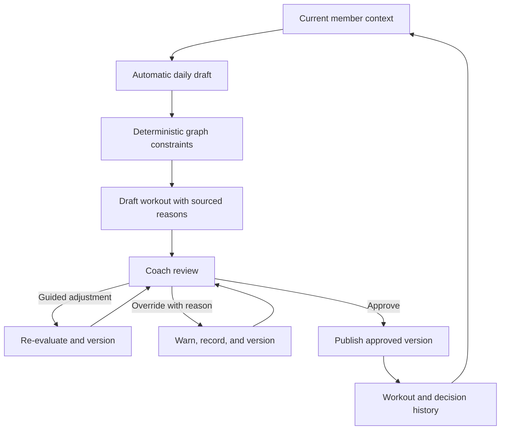
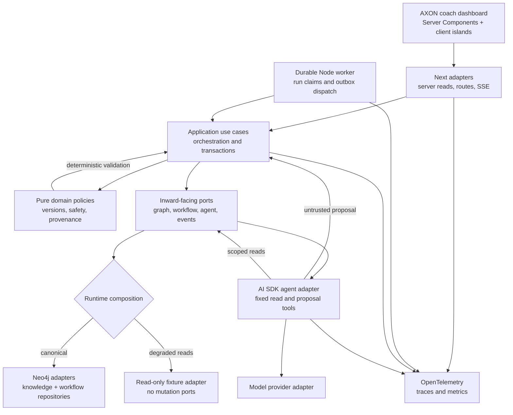
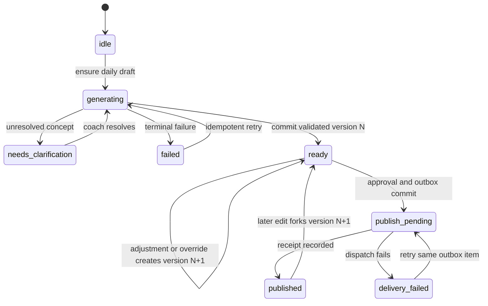

# Graph-Backed Coach Dashboard - Plan

## Goal Capsule

- **Objective:** Build a polished portfolio product that helps a coach review, adjust, explain, and approve automatically generated daily workouts while using the same member context for grounded coaching support.
- **Product authority:** The Product Contract below governs behavior and scope. `ASSESSMENT.md`, `README.md`, and the AXON materials under `ui/` supply the source brief and interface authority where this plan does not explicitly revise them.
- **Execution profile:** Deliver the product as reviewable coach-day vertical slices in dependency order, with deterministic graph safety and authenticated human approval treated as release gates.
- **Stop conditions:** Stop implementation if deterministic safety becomes prompt-only, an unvalidated workout can become reviewable, a non-coach path can override or publish, or production routes depend on the Design Canvas runtime.
- **Tail ownership:** The final increment owns one-command local startup, hosted showcase reliability, evaluation evidence, documentation, and the cleanup of abandoned implementation paths.

---

## Product Contract

### Summary

The product is a coach-facing dashboard that prepares source-backed daily workout drafts, guides review and adjustment, and requires coach approval before publication.
It combines movement and member-context knowledge graphs, a grounded Copilot, and path-focused graph visualization in one coherent coach-day experience.
The production interface translates the AXON design system and flagship interaction storyboard into an accessible responsive application without shipping the prototype runtime.

### Problem Frame

Coaches must assemble goals, injuries, equipment, training history, adherence, conversations, biomarkers, and other member signals before making a useful recommendation.
That work is slow, and a language model acting alone cannot provide the deterministic safety or traceability required for trustworthy exercise selection.

The portfolio must demonstrate that the graph does real reasoning work, that the AI remains grounded in synthetic member data, and that a coach can understand and control the result.
It must also communicate technical depth without fragmenting into unrelated capability demos.

### Key Decisions

- **Optimize for an exceptional portfolio product.** (session-settled: user-directed — chosen over a production-shaped or production-ready product: polish, assessability, and technical storytelling are the primary standard.) Governs R30-R35.
- **Keep the complete brief and every named enhancement.** (session-settled: user-directed — chosen over required-only or selectively enhanced scope: the deadline constraint was removed so each capability can be developed well.) Governs R25-R35.
- **Organize the product around coach-day vertical increments.** (session-settled: user-directed — chosen over foundation-first and independent capability showcases: each increment should deliver a coherent user outcome.) Governs R1-R9, R33.
- **Generate daily drafts automatically but require coach approval.** (session-settled: user-directed — chosen over automatic publication: the coach remains accountable for what reaches the member.) Governs R1, R4, R9.
- **Permit safety overrides with a documented reason.** (session-settled: user-directed — chosen over hard-blocking every unsafe request: controlled professional judgment takes precedence over absolute prevention.) Governs R8, R17.
- **Retain every material workout version.** (session-settled: user-approved — chosen over keeping only the latest state: reviewers and coaches need to see what changed, why, and by whom.) Governs R7-R9.
- **Use graph visualization as an explanation surface.** (session-settled: user-approved — chosen over decorative or unrestricted graph browsing: the visualization should clarify active recommendation and retrieval paths.) Governs R18.
- **Use AXON as the interface contract.** The production UI preserves its human-versus-machine semantics, interaction vocabulary, and calm source-backed voice while correcting prototype-only limitations. Governs R32, R36.

### Actors

- A1. **Coach:** Reviews member context, adjusts generated workouts, records override reasons, and approves the version sent to the member.
- A2. **Member:** Receives an approved workout personalized to their current context.
- A3. **Coach assistant:** Prepares daily drafts, resolves concepts, coordinates graph-grounded reasoning, explains results, and answers member-context questions.
- A4. **Deterministic safety layer:** Applies graph constraints independently of probabilistic language-model instructions.

### Product Increments

1. **Trusted daily draft:** Generate the daily workout with deterministic constraints, provenance, and coach approval.
2. **Guided coach control:** Add adjustment guidance, safe substitutions, documented overrides, diffs, and version history.
3. **Member-context workflow:** Add the morning brief, grounded Copilot, quick prompts, charts, history, and longitudinal reasoning.
4. **Visible reasoning:** Add path-focused graph visualization across recommendations, exclusions, substitutions, and Copilot answers.
5. **Multi-agent orchestration:** Make specialized reasoning responsibilities and their coordination visible and evaluable.
6. **Streaming:** Show useful progress and validated partial results during longer AI work.
7. **Evaluation pipeline:** Measure retrieval, resolution, safety, recommendation, provenance, and longitudinal behavior.
8. **Observability:** Connect model, agent, tool, graph, and user-visible activity in inspectable traces.
9. **Deeper clinical grounding:** Expand the justified SNOMED CT subset and its useful graph relationships.
10. **Longitudinal reasoning:** Deepen how stable preferences, recent state, and historical trends affect recommendations and answers.

### Requirements

**Daily workout workflow**

- R1. The system automatically prepares a new workout draft for the active member each day before coach review.
- R2. Each draft contains warmup, main, and cooldown sections with exercises, sets, repetitions or duration, and rest guidance sized to the requested time window.
- R3. Each draft reflects the member's goals, current injuries, equipment, preferences, recent training, recovery signals, and adherence context.
- R4. A draft cannot be published to the member until a coach explicitly approves it.
- R5. The coach receives guided adjustment controls for goals, duration, intensity, injury state, equipment, preferences, exclusions, and substitutions.
- R6. Every adjustment reruns the relevant constraints and shows the coach the resulting workout changes with updated reasons.
- R7. The system retains every immutable content version with parent and applicable reason context, plus append-only approval and publication events tied to the selected version with actor, time, member-context revision, trace identifiers, and any reason required by policy.
- R8. A coach may override a graph warning only after supplying a reason, and the warning remains attached to the resulting version.
- R9. Publication sends the exact approved version and preserves its relationship to all prior drafts.

**Movement and clinical reasoning**

- R10. The movement graph represents exercises, muscles, joints or body regions, movement patterns, equipment, injuries or conditions, anatomy hierarchy, contraindications, and equivalence relationships.
- R11. Domain concepts are grounded in a meaningful subset of OPE, COPPER, SNOMED CT, SKOS, and PROV-O rather than importing those ontologies wholesale.
- R12. Free text resolves to canonical graph concepts through exact, fuzzy, and semantic fallback passes with visible confidence.
- R13. Unresolved or low-confidence concepts trigger clarification or safe degradation instead of fabricated mappings.
- R14. Injury, anatomy, equipment, explicit-exclusion, and preference decisions are enforced through graph traversal rather than prompt instructions alone.
- R15. Anatomy traversal includes relevant descendants so a constraint on a body region also applies to its modeled substructures.
- R16. When equipment or safety rules remove an exercise, the system uses graph relationships to offer suitable alternatives when available.
- R17. Every selected, excluded, substituted, or overridden exercise carries source-backed reasons and the graph path that produced the decision.
- R18. Graph visualization emphasizes the relevant subgraph for a selected recommendation, exclusion, substitution, override, or Copilot answer while preserving source and provenance labels.

**Member context and Copilot**

- R19. The member graph represents profile, goals, preferences, equipment, injuries, workout history, adherence, biomarkers, labs, conversations, images, coach tasks, and churn signals from synthetic data.
- R20. The Copilot answers member-specific questions only from retrievable member context and identifies the evidence supporting each answer.
- R21. The Copilot supports the morning brief, adherence, sleep, week-over-week change, message-pattern, and four-week comparison prompts with appropriate charts.
- R22. Coaches can inspect relevant past conversations and images while asking follow-up questions.
- R23. The morning brief connects recent accomplishments, current risks, pending coach actions, and the day's generated workout.
- R24. Longitudinal reasoning distinguishes recent state, historical trend, and stable preference when personalizing workouts or answering questions.

**Portfolio quality and system behavior**

- R25. Distinct agent responsibilities are visible for concept resolution, graph retrieval, safety reasoning, workout composition, member-context retrieval, and explanation.
- R26. Long-running AI responses stream useful progress or partial results without presenting unvalidated workout content as final.
- R27. An evaluation pipeline measures concept resolution, retrieval relevance, constraint correctness, recommendation quality, provenance completeness, and longitudinal reasoning.
- R28. Observability connects language-model calls, agent actions, tool use, graph queries, constraint outcomes, and user-visible responses into an inspectable trace.
- R29. Automated tests cover concept resolution, deterministic safety, approval gating, overrides, provenance, and the critical integrated flows.
- R30. Interactive AI responses target completion within approximately five seconds while preserving correctness and provenance.
- R31. All bundled and generated member data remains synthetic, with no real member data or protected health information.
- R32. A mock-authenticated coach can move through the member brief, generator, approval workflow, Copilot, charts, history, and graph explanations within one dashboard.
- R33. Every required capability and named enhancement ships as a separately reviewable increment that remains integrated into the coach-day narrative.
- R34. The repository documentation includes a system architecture diagram, technology rationale, AI usage, challenges, trade-offs, and a production evaluation strategy.
- R35. The repository supports one-command local operation and documents two or three example inputs with generated outputs, including injury and limited-equipment cases with their traces.
- R36. The production dashboard follows the AXON interaction and visual contract across mobile and desktop, with keyboard access, reduced-motion behavior, and non-color-only human-versus-machine semantics.

### Daily Workout Lifecycle



### Key Flows

- F1. Daily draft review
  - **Trigger:** A new coach day begins for a member.
  - **Actors:** A1, A2, A3, A4
  - **Steps:** The assistant prepares a graph-constrained draft, the coach reviews its member context and reasons, and approval publishes the selected version.
  - **Covers:** R1-R4, R9, R14, R17.
- F2. Guided workout adjustment
  - **Trigger:** The coach wants to change the draft or reports new member context.
  - **Actors:** A1, A3, A4
  - **Steps:** The coach selects or describes the change, the assistant identifies relevant controls, the safety layer re-evaluates the plan, and the dashboard shows the changed version and reasons.
  - **Covers:** R5-R7, R12-R17.
- F3. Safety override
  - **Trigger:** A coach chooses a change that still carries a graph warning.
  - **Actors:** A1, A3, A4
  - **Steps:** The dashboard explains the warning and alternatives, the coach records a reason, and the system creates a visibly overridden version for approval.
  - **Covers:** R7-R9, R17.
- F4. Morning member review
  - **Trigger:** The coach opens the member dashboard or asks a quick prompt.
  - **Actors:** A1, A3
  - **Steps:** The assistant retrieves relevant context, distinguishes current state from trend, renders evidence or charts, and connects findings to the day's coaching actions.
  - **Covers:** R19-R24, R32.
- F5. Explanation inspection
  - **Trigger:** The coach or reviewer selects a recommendation, exclusion, substitution, override, or Copilot claim.
  - **Actors:** A1, A3, A4
  - **Steps:** The dashboard reveals the supporting sources and focused graph path without requiring unrestricted graph navigation.
  - **Covers:** R17-R18, R20, R28.

### Acceptance Examples

- AE1. Automatic daily draft
  - **Covers R1-R4, R17.**
  - **Given:** Jordan has a recovering left-knee injury, home equipment constraints, goals, and recent training context.
  - **When:** The daily generation cycle runs.
  - **Then:** A complete draft appears for coach review with no publication and with source-backed reasons for each exercise.
- AE2. Anatomy-aware injury handling
  - **Covers R14-R17.**
  - **Given:** The coach reports that Jordan's left knee is bothering her.
  - **When:** The workout is generated or revised.
  - **Then:** The safety layer traverses the anatomy hierarchy, removes or down-ranks relevant stressors, and explains the affected graph paths.
- AE3. Limited-equipment substitution
  - **Covers R5-R6, R14, R16-R17.**
  - **Given:** Jordan has dumbbells and a kettlebell but no barbell.
  - **When:** A draft contains a barbell-dependent movement candidate.
  - **Then:** The candidate is removed and an equipment-valid equivalent is suggested with the substitution reason.
- AE4. Explicit exercise exclusion
  - **Covers R5-R6, R14, R17.**
  - **Given:** The coach excludes deadlifts.
  - **When:** The current or later daily workout is evaluated.
  - **Then:** Deadlifts and mapped variations do not appear unless the coach deliberately changes the exclusion.
- AE5. Ambiguous concept
  - **Covers R12-R13.**
  - **Given:** A coach phrase cannot be mapped above the required confidence.
  - **When:** Concept resolution completes.
  - **Then:** The system requests clarification or applies a safe fallback and never invents a canonical match.
- AE6. Documented override
  - **Covers R7-R9, R17.**
  - **Given:** A requested exercise retains a graph-derived safety warning.
  - **When:** The coach overrides it and supplies a reason.
  - **Then:** A new version records the warning, reason, actor, alternatives offered, and approval state before publication is possible.
- AE7. Version comparison
  - **Covers R6-R9.**
  - **Given:** A coach changes duration, equipment, or intensity more than once.
  - **When:** The coach reviews workout history.
  - **Then:** Each version shows what changed and why, and the published workout matches the approved version exactly.
- AE8. Grounded longitudinal answer
  - **Covers R19-R24.**
  - **Given:** The coach asks what changed since last week and whether Jordan may churn.
  - **When:** The Copilot answers.
  - **Then:** The answer separates current signals from trends, cites member evidence, renders an appropriate chart, and avoids unsupported conclusions.
- AE9. Focused graph explanation
  - **Covers R17-R18, R20.**
  - **Given:** The coach selects a knee-related exclusion or a Copilot claim.
  - **When:** The graph view opens.
  - **Then:** The relevant source nodes and reasoning path are emphasized without forcing the coach to interpret the full graph.
- AE10. AXON interaction parity
  - **Covers R32, R36.**
  - **Given:** The coach uses the dashboard with keyboard controls, reduced motion, or a desktop viewport.
  - **When:** The coach completes the Today, Workout, Copilot, History, decision-path, override, and approval flows.
  - **Then:** Each flow retains AXON's human-versus-machine meaning, remains operable without color alone, and preserves the same server-owned workout state across layouts.

### Success Criteria

- Deterministic constraint checks pass for 100% of the injury, equipment, and explicit-exclusion evaluation scenarios unless a recorded override applies.
- At least 90% of representative workout scenarios are approvable unchanged or after one non-safety adjustment.
- A coach can understand, adjust, and approve a typical daily draft within two minutes.
- Every generated plan and grounded Copilot answer satisfies the provenance obligations in R17 and R20.
- Interactive performance meets the target in R30 without bypassing graph reasoning or validation.
- Every increment named in R33 has focused acceptance evidence and participates in at least one integrated coach-day flow.
- Critical AXON flows pass keyboard, 320 CSS-pixel reflow, reduced-motion, and non-color-only semantics checks.

### Scope Boundaries

**In scope**

- Both knowledge graphs, both dashboard surfaces, every required build step, and every nice-to-have named in `ASSESSMENT.md`.
- Automatic daily generation, guided coach review, approval gating, documented overrides, version history, and graph-backed explanations.
- A polished synthetic-data portfolio experience with production-quality reasoning and evaluation.
- Production translation of the AXON design language and flagship interaction storyboard, including missing History, free-text Copilot, conversation/image, failure, reconnect, and responsive states.

#### Deferred to Follow-Up Work

- Durable member-profile changes initiated from natural-language workout adjustments; current-plan statements affect only the workout's effective-context snapshot.
- A real member-delivery integration beyond the simulated publication outbox and durable receipt.
- A Python service unless a later implementation discovery proves a Python-only capability is necessary.
- A general-purpose graph canvas after the focused semantic explanation surface is proven insufficient.

**Outside this product's identity**

- Real member data, protected health information, or claims that the portfolio is a clinically validated medical device.
- Production-grade deployment serving real members, regulatory certification, enterprise operations, billing, or organization-wide administration. The Vercel-and-Aura portfolio showcase remains in scope.
- A standalone member application beyond receiving the approved workout.
- An unrestricted knowledge-graph editor or exhaustive ingestion of every source ontology.
- Deadline-driven feature cuts or a one-day delivery constraint.

### Dependencies and Assumptions

- `data/exercises.json` and `data/member-context.json` are the canonical product fixtures, and any added data will remain synthetic.
- `ui/Coach Dashboard v2.dc.html`, `ui/readme.md`, and `ui/tokens/` are the current AXON interface authority; `ui/Coach Dashboard.dc.html` and `ui/Coach Dashboard Wireframes.dc.html` remain historical references.
- Published ontology concepts may be represented through a justified local subset when full ontology ingestion or live access adds no product value.
- Probabilistic models may interpret language and compose explanations, but A4 remains authoritative for deterministic constraints.
- Charts and graph visualization derive from the same structured facts and provenance used by the assistant rather than separate presentation-only data.
- The complete scope will be delivered incrementally, with quality judged per increment rather than against a fixed calendar deadline.
- Model-backed behavior uses a provider adapter and deterministic test doubles; the default interactive provider is configured at runtime.

### Sources and Research

- `ASSESSMENT.md` — authoritative source brief, evaluation criteria, required scenarios, ontology guidance, build steps, and named enhancements.
- `README.md` — repository-level product summary and deliverable framing.
- `data/exercises.json` — synthetic exercise catalog used by movement reasoning.
- `data/member-context.json` — synthetic Jordan Rivera context used by daily generation and Copilot flows.
- `ui/readme.md` and `ui/SKILL.md` — AXON visual, semantic, content, motion, and asset rules.
- `ui/Coach Dashboard v2.dc.html` — canonical interaction storyboard for Today, Workout, Copilot, adjustments, overrides, approval, and decision lanes.
- `ui/components/` and `ui/tokens/` — prototype primitives and token values to translate into production-owned TypeScript and CSS.

---

## Planning Contract

### Product Contract Preservation

Changed: R36 and AE10 were added to bind the user-supplied AXON package to the production interface; all earlier R/A/F/AE IDs and their meaning remain unchanged.

### Key Technical Decisions

- KTD1. **Keep `ui/` build-disconnected and translate it into production-owned AXON modules.** The design directory remains a reference archive for tokens, copy, states, and visual baselines. Shipped routes must not import `ui/support.js`, `.dc.html` files, prototype JSX, or duplicated `ui/uploads/` data. Governs R32, R36.
- KTD2. **Use one Node 24 TypeScript application on Next.js 16.2 Active LTS and React 19.2.** A single runtime keeps UI, application use cases, agent adapters, schemas, streaming, and observability aligned. Next routes and workers are outer adapters; pure domain policies depend inward on repository, provider, and event ports with no Next, React, AI SDK, or Neo4j driver types. Pin AI SDK 7 and add Python only for a proven Python-only capability. Governs R25-R26, R30, R32, R35.
- KTD3. **Use Neo4j 2026.06 with JavaScript driver 6.2 behind separate graph and workflow repository ports.** One deployment simplifies the take-home while supporting movement traversal, member context, retrieval, provenance, immutable versions, and approval/outbox records. Separate ports, schema ownership, and retention boundaries keep a future relational workflow store viable. Use static parameterized Cypher, allowlisted structural choices, bounded traversals, uniqueness constraints, dataset revisions, Cypher 25 `SEARCH`, and weighted reciprocal-rank fusion. Governs R10-R20, R24, R27-R28.
- KTD4. **Make typed application and domain contracts authoritative.** `MemberContextSnapshot`, `AdjustmentIntent`, `ConceptResolution`, `ConstraintDecision`, `ProvenancePath`, immutable `WorkoutVersion`, lifecycle events, `PublicationReceipt`, and `RunEvent` exist independently of JSX and infrastructure SDKs. Invariant-bearing IDs and payload digests bind every reference to one authorized member and immutable snapshot. UI view models and agent tool results project from the same records. Governs R3-R9, R17, R20, R28.
- KTD5. **Approve one expected immutable version and create its outbox item in one authenticated transaction.** (session-settled: user-directed — chosen over automatic publication: the coach remains accountable for what reaches the member.) Server session identity supplies the coach and member scope. The transaction verifies authorization, expected version, context revision, validation, overrides, and request digest, then appends approval and one idempotent outbox item. A separate dispatcher delivers by version and payload digest and records the receipt; approval never transfers or rolls back on delivery failure. Governs R1, R4, R7-R9.
- KTD6. **Stage safety overrides as coach-authored version changes.** (session-settled: user-directed — chosen over hard-blocking every unsafe request: controlled professional judgment takes precedence over absolute prevention.) The assistant may explain or propose, but the authenticated coach supplies a bounded reason and confirms the eligible warning on an expected version. Store the reason as escaped data; the new immutable version retains warning, alternatives, actor, and reason. Governs R7-R9, R17.
- KTD7. **Give agents fixed primitive read, reasoning, and proposal tools but no approval or publication tool.** Retrieved evidence and model output are untrusted data. Resource scope is injected outside the model, tool arguments and results are schema-validated, queries remain server-authored, and the agent proposal must pass deterministic resolution and safety before an immutable version can become `ready`. Governs R4, R8-R9, R20, R25.
- KTD8. **Separate route streaming, durable run state, and execution ownership.** Initial Server Component rendering uses Suspense. Route Handlers submit or reattach, a separately invokable Node worker claims persisted runs, and SSE or AI SDK `UIMessage` data parts replay privacy-safe ordered events. Initial and reconnect requests verify run ownership; only deterministic validation can commit a reviewable draft or final Copilot answer. Governs R13, R20, R26, R28, R30.
- KTD9. **Render focused evidence paths with semantic DOM before adopting a general graph canvas.** The default explanation is a bounded member-to-anatomy-to-rule-to-workout chain with ordered textual fallback, source revisions, and why each hop matters. Path ranking uses validity, authority, freshness, and workflow state before hop count. Governs R17-R18, R20, R36.
- KTD10. **Support three explicit portfolio modes.** Local mode uses Docker Compose and seeded Neo4j. Hosted mode uses Vercel and Aura. Degraded showcase mode is visibly read-only and fixture-backed; safety and publication fail closed when canonical graph state is unavailable. Governs R29-R31, R34-R35.
- KTD11. **Correlate product evidence and telemetry by stable identifiers.** Next instrumentation and OpenTelemetry spans carry run, trace, tool-call, graph-query, version, constraint-decision, and response IDs. Sensitive prompt or graph text is excluded by default. Repository evaluations remain the source of truth for correctness. Governs R17, R20, R27-R28.
- KTD12. **Implement AXON with semantic tokens, CSS Modules, and narrow client islands.** Server Components own reads and composition. Client Components are limited to interaction, dialogs, charts, live subscriptions, and browser state. Human and machine ownership is conveyed by text, icon, shape, and accessible names as well as ink or Signal. Governs R32, R36.

### High-Level Technical Design

#### Component topology



#### Workout and publication state



The state machine describes the workout aggregate and its `currentVersionId`. Each content version is immutable and remains terminal; adjustment or post-publication editing creates a new version, while approval and publication remain append-only events on the selected version.

#### Human-gated approve and publish

```mermaid
sequenceDiagram
  participant C as Coach browser
  participant R as Next mutation boundary
  participant P as Policy service
  participant G as Neo4j transaction
  participant W as Outbox dispatcher
  participant D as Simulated delivery adapter

  C->>R: Approve and publish expected version
  R->>P: Re-authorize coach and member access
  P->>G: Verify version, context revision, validation, overrides
  alt current and valid
    G->>G: Append approval and idempotent outbox item
    G-->>R: Accepted publish-pending version
    R-->>C: Approval saved; publication pending
    W->>G: Claim outbox item
    W->>D: Deliver version and payload digest
    D-->>W: Delivery result
    W->>G: Record receipt or retryable failure
  else stale or invalid
    G-->>R: Conflict with authoritative current state
    R-->>C: Return to review; publish nothing
  end
```

### Output Structure

```text
src/
  app/
    (coach)/
      page.tsx
      loading.tsx
    api/
      copilot/route.ts
      runs/[runId]/events/route.ts
      workouts/[workoutId]/adjust/route.ts
      workouts/[workoutId]/override/route.ts
      workouts/[workoutId]/approve-publish/route.ts
      internal/daily-drafts/route.ts
    layout.tsx
  agents/
    coach-runtime.ts
    tools/
  application/
    ports/
    use-cases/
  domain/
    contracts/
    policies/
  graph/
    cypher/
    ingest/
    repositories/
    schema/
  features/
    coach-day/
    copilot/
    member/
    reasoning/
    workouts/
  observability/
  workers/
    run-worker.ts
    outbox-dispatcher.ts
  instrumentation.ts
  ui/axon/
    components/
      agentic/
      core/
      data/
    stories/
    styles/
    README.md
  evals/
tests/
  integration/
  e2e/
  fixtures/
public/
  fonts/
  synthetic/
scripts/
  seed.ts
  reset-demo.ts
compose.yaml
Dockerfile
package.json
playwright.config.ts
vitest.config.ts
vercel.json
```

### Alternative Approaches Considered

- **React/Vite plus a Python API:** Strong if a Python-only graph or model capability appears, but currently duplicates runtime, contracts, streaming, authentication, deployment, and telemetry without a capability gain.
- **Import the prototype JSX or Design Canvas runtime:** Faster for a static demo, but it preserves inline state, CDN/evaluation behavior, accessibility gaps, hardcoded Jordan data, and client authority over safety-sensitive actions.
- **Use an embedded graph:** Lower local setup cost, but the leading embedded property-graph option Kuzu was archived in 2025 and the remaining options add maturity risk. Neo4j gives local/hosted driver parity and current vector/full-text support.
- **Use Neo4j for knowledge and a relational store or queue for workflow state:** Stronger infrastructure specialization for production, but it adds a second datastore, migrations, deployment, and cross-store consistency to a portfolio build. Separate repository ports keep this migration available if workflow load or operational needs later justify it.
- **Adopt a general graph canvas first:** Visually impressive, but it weakens the focused explanation requirement and creates keyboard, screen-reader, and layout risk before the underlying evidence contract is proven.

### Sources and Research

- [Next.js Server and Client Components](https://nextjs.org/docs/app/getting-started/server-and-client-components) and [Route Handlers](https://nextjs.org/docs/app/getting-started/route-handlers) shape KTD2, KTD8, KTD12, U1, and U6.
- [AI SDK 7](https://vercel.com/blog/ai-sdk-7) and the [typed stream protocol](https://ai-sdk.dev/docs/ai-sdk-ui/stream-protocol) shape KTD2, KTD7-KTD8, and U6.
- [Neo4j managed transactions](https://neo4j.com/docs/javascript-manual/current/transactions/), [concurrency controls](https://neo4j.com/docs/operations-manual/current/database-internals/concurrent-data-access/), and [vector indexes](https://neo4j.com/docs/cypher-manual/current/indexes/semantic-indexes/vector-indexes/) shape KTD3-KTD5, U2-U4, and the transactional verification gates.
- [RFC 9110 conditional requests](https://www.rfc-editor.org/rfc/rfc9110.html#name-if-match) grounds expected-version mutation semantics in KTD5 and U3.
- [W3C PROV-O](https://www.w3.org/TR/prov-o/#wasRevisionOf) shapes immutable derivation and historical explanation in KTD4, KTD9, U3, and U5.
- [WCAG 2.2 reflow](https://www.w3.org/WAI/WCAG22/Understanding/reflow.html), [status messages](https://www.w3.org/WAI/WCAG22/Understanding/status-messages.html), and [use of color](https://www.w3.org/WAI/WCAG22/Understanding/use-of-color.html) shape R36, KTD12, U1, U5, and U6.
- [Playwright visual comparisons](https://playwright.dev/docs/test-snapshots) and [accessibility testing](https://playwright.dev/docs/accessibility-testing) shape the deterministic visual and accessibility verification strategy.

### System-Wide Impact

- **Coach trust:** Ink and Signal are projections of structured actor and evidence metadata, never the source of truth for authority.
- **Data lifecycle:** Workout versions, context revisions, evidence snapshots, approvals, overrides, and publication receipts are immutable or append-only.
- **Concurrency:** Every mutation names an expected workout version; approval also verifies the member-context revision. Stale requests fail without partial writes.
- **Agent parity:** UI and agent tools read the same member, workout, evidence, and trace records. The agent can propose but cannot confirm override reasons, approve, or publish.
- **Streaming:** Navigation does not cancel a durable run by default. Reopening a surface reattaches by run ID; explicit cancellation marks a terminal state and ignores later results.
- **Accessibility:** Status changes use live-region semantics, graphs include ordered text, dialogs manage focus, charts carry summaries, and motion honors user preferences.
- **Portfolio reliability:** Hosted database unavailability degrades to a labeled read-only fixture mode instead of a blank or unsafe experience.
- **Security boundary:** Mock authentication still creates a server-owned coach session. Every route, repository, agent tool, decision path, and event stream re-authorizes the complete coach-to-member-to-resource relationship.
- **Request integrity:** Cookie-authenticated mutations accept only verified same-origin requests, and streamed runs re-authorize both initial connection and reconnect.
- **Untrusted content:** Member evidence and model output remain escaped data. Tool registries are fixed, resource scope is server-injected, and Cypher structure comes only from bounded server allowlists.
- **Transaction integrity:** Managed transaction callbacks perform no external effects. Approval commits with an outbox item; delivery and receipt recovery use version, destination, and payload digest for idempotency.
- **Operational safety:** Degraded mode and seed/reset authority are server-derived. Fixture repositories expose no mutation port, rejected degraded writes are never queued, and reset activates only a complete synthetic dataset revision.
- **Telemetry privacy:** Traces contain identifiers, states, timings, and redacted error classes, not raw prompts, evidence, override reasons, graph text, credentials, or session data.

### Risks and Mitigations

- **Scope breadth dilutes the core story:** Preserve the Product Contract's coach-day increment order and require one integrated acceptance flow per increment.
- **Prototype polish is mistaken for production readiness:** Treat visual output as a baseline, then replace hardcoded data, timers, inline styles, client authority, and inaccessible click targets.
- **Neo4j becomes a bottleneck for workflow state:** Keep repository contracts independent of Cypher, use constraints and managed transactions, and test concurrent mutation behavior against the pinned container.
- **Agent output bypasses deterministic safety:** Require structured tool results and a final deterministic validation gate before any workout version becomes `ready`.
- **Historical explanations drift:** Snapshot evidence values and source revisions on every version instead of dereferencing only current graph facts.
- **Hosted portfolio sleeps or loses dependencies:** Seed/reset automatically, health-check indexes, expose degraded read-only fixtures, and never allow degraded writes.
- **Visual semantics exclude users:** Pair color with text, glyph, and accessible names; test reflow, keyboard order, focus, forced colors, reduced motion, and live status manually as well as automatically.
- **Resource-ID substitution exposes another member:** Resolve actor identity from the session and enforce resource ownership inside every read, mutation, stream, and transaction.
- **Cross-origin requests perform coach mutations:** Enforce restrictive cookies plus CSRF tokens or strict Origin and Host validation on every cookie-authenticated mutation.
- **Prompt, tool, or Cypher injection escapes intended scope:** Treat retrieved content as untrusted, prohibit model-authored queries, parameterize values, allowlist structure, cap traversal complexity, and escape rendered content.
- **Run streams leak cross-member status or evidence:** Authorize each connection and reconnect, disable shared caching, validate run-scoped event IDs, and stream bounded privacy-safe projections.
- **Transaction retries or response loss duplicate state:** Bind idempotency to actor, resource, action, expected revisions, and request digest; changed-payload key reuse conflicts and exact replay returns the recorded outcome.
- **Seed/reset corrupts the canonical demo:** Limit reset to marked synthetic namespaces, validate the complete incoming dataset, serialize activation, and retain the previous active revision after interruption.

---

## Implementation Units

### U1. Production shell and AXON foundation

- **Goal:** Create a runnable responsive coach-day shell and production-owned AXON system that preserves the design source without depending on its runtime.
- **Requirements:** R31-R33, R35-R36; A1; F4; AE10.
- **Dependencies:** None.
- **Files:**
  - `package.json`
  - `pnpm-lock.yaml`
  - `.nvmrc`
  - `tsconfig.json`
  - `next.config.ts`
  - `src/app/layout.tsx`
  - `src/app/(coach)/page.tsx`
  - `src/ui/axon/styles/tokens.css`
  - `src/ui/axon/styles/globals.css`
  - `src/ui/axon/components/core/*.tsx`
  - `src/ui/axon/components/data/*.tsx`
  - `src/ui/axon/components/agentic/*.tsx`
  - `src/ui/axon/stories/*.stories.tsx`
  - `src/ui/axon/README.md`
  - `public/fonts/*`
  - `tests/e2e/axon-responsive.spec.ts`
  - `tests/e2e/axon-accessibility.spec.ts`
- **Approach:**
  1. Pin Node 24, Next 16.2 Active LTS, React 19.2, TypeScript, Vitest, Storybook, and Playwright.
  2. Translate `ui/tokens/` into semantic production tokens and self-host Archivo and JetBrains Mono with their licenses.
  3. Rebuild prototype primitives as strict TypeScript components with finite state unions, native element props, stable IDs, accessible names, focus behavior, and reduced-motion support.
  4. Compose a Server Component dashboard shell with narrow client islands and responsive stacked-mobile versus multi-region-desktop layouts.
  5. Keep `ui/` outside build contexts and document the mapping from reference artifacts to production modules.
- **Patterns to follow:** `ui/readme.md`, `ui/tokens/`, `ui/components/`, and `ui/Coach Dashboard v2.dc.html`; follow KTD1 and KTD12.
- **Test scenarios:**
  1. Covers AE10. At 320, 390, and 430 CSS pixels, Today, Workout, Copilot, History, and sticky actions reflow without page-level horizontal scrolling or obscured focus.
  2. At 1280 pixels, the same canonical mock state renders in a useful coach workspace without losing mobile navigation or actions.
  3. Keyboard users can operate tabs, accordions, dialogs, segmented controls, and approval actions with visible focus and correct focus return.
  4. Human actions and machine-produced content remain distinguishable when colors are removed or forced colors are enabled.
  5. Reduced-motion users receive static Signal states while status meaning remains visible.
  6. Production bundles contain no import or runtime fetch from `ui/support.js`, `.dc.html` files, Google Fonts, unpkg, or `ui/uploads/`.
- **Verification:** The shell starts from the root command, AXON component stories cover finite states and edge content, and visual/accessibility baselines pass on the pinned browser and fonts.

### U2. Trusted daily draft vertical slice

- **Goal:** Deliver the first complete coach outcome: seed the movement graph, resolve a request, apply deterministic safety, prepare today's immutable draft, and render it for review without publication.
- **Requirements:** R1-R4, R10-R17, R25, R29-R33; A1-A4; F1; AE1-AE5.
- **Dependencies:** U1.
- **Files:**
  - `compose.yaml`
  - `Dockerfile`
  - `.env.example`
  - `scripts/seed.ts`
  - `src/domain/contracts/member-context.ts`
  - `src/domain/contracts/workout.ts`
  - `src/domain/contracts/provenance.ts`
  - `src/graph/schema/*.cypher`
  - `src/graph/ingest/exercises.ts`
  - `src/graph/ingest/ontology-subset.ts`
  - `src/graph/repositories/movement-graph.ts`
  - `src/application/ports/graph-repositories.ts`
  - `src/application/use-cases/ensure-daily-draft.ts`
  - `src/domain/policies/concept-resolution.ts`
  - `src/domain/policies/safety-evaluation.ts`
  - `src/app/api/internal/daily-drafts/route.ts`
  - `src/features/coach-day/TodayPanel.tsx`
  - `src/features/workouts/WorkoutReviewPanel.tsx`
  - `tests/unit/concept-resolver.test.ts`
  - `tests/unit/safety-evaluator.test.ts`
  - `tests/integration/movement-graph.test.ts`
  - `tests/integration/daily-draft.test.ts`
  - `tests/e2e/daily-draft.spec.ts`
- **Approach:**
  1. Create a constrained local ontology aligned to OPE, COPPER, SNOMED CT, SKOS, and PROV-O with documented source identifiers and mapping reasons.
  2. Ingest canonical `data/exercises.json` and the relevant member snapshot into Neo4j with named uniqueness, full-text, and vector indexes.
  3. Implement exact, fuzzy, and semantic concept-resolution passes with explicit thresholds and a clarification result.
  4. Implement deterministic anatomy, injury, equipment, preference, exclusion, and equivalence traversal before workout composition.
  5. Ensure one daily draft per member-local date with an idempotent scheduled trigger and dashboard-load fallback.
  6. Atomically persist the validated version, context revision, constraint decisions, evidence snapshot, and parent relation before advancing the aggregate to `ready`.
  7. Seed into a new synthetic dataset revision, validate its constraints and indexes, then switch the active revision; never expose a partially seeded graph.
- **Execution note:** Start with failing resolver, safety, and daily-draft integration scenarios against the real pinned Neo4j container.
- **Patterns to follow:** AE1-AE5, the four-lane explanation vocabulary in `ui/Coach Dashboard v2.dc.html`, KTD3-KTD4, and KTD7.
- **Test scenarios:**
  1. Covers F1 / AE1. Jordan's seeded context creates one complete 50-minute draft for the member-local date with warmup, main, cooldown, dose, rest, and provenance; it remains unpublished.
  2. Covers AE2. A left-knee input traverses modeled descendants, removes deep-flexion and plyometric candidates, and records each affected path.
  3. Covers AE3. A barbell candidate is removed when only dumbbells and a kettlebell are available, and a graph-valid equivalent is returned.
  4. Covers AE4. Excluding deadlifts removes mapped variations without relying on prompt wording.
  5. Covers AE5. A phrase below the confidence threshold creates a clarification state and no workout version.
  6. A mixed high- and low-confidence input creates no partial version until the ambiguous concept is resolved.
  7. Removing every valid main exercise fails closed into coach-input-needed while retaining exclusions and evidence.
  8. Repeating the same daily trigger returns the existing run and version instead of duplicating either.
  9. A failed version transaction leaves no partial `ready` version, evidence snapshot, or aggregate pointer.
  10. Repeated seed is idempotent; interrupted or mixed-revision seed preserves the previous complete active dataset.
- **Verification:** The real graph integration proves every chosen, excluded, or substituted exercise from stored relationships, and the dashboard shows only the persisted validated version.

### U3. Guided adjustment, override, and immutable publication lifecycle

- **Goal:** Let the coach adjust, compare, override, approve, and publish while protecting exact-version history, authorization, and concurrency.
- **Requirements:** R4-R9, R12-R17, R29, R32-R33; A1-A4; F2-F3; AE3-AE7.
- **Dependencies:** U2.
- **Files:**
  - `src/domain/contracts/adjustment.ts`
  - `src/domain/contracts/workout-version.ts`
  - `src/domain/policies/coach-authorization.ts`
  - `src/domain/policies/workout-lifecycle.ts`
  - `src/application/use-cases/adjust-workout.ts`
  - `src/application/use-cases/override-warning.ts`
  - `src/application/use-cases/approve-workout.ts`
  - `src/application/ports/publication-outbox.ts`
  - `src/workers/outbox-dispatcher.ts`
  - `src/graph/repositories/workout-versions.ts`
  - `src/app/api/workouts/[workoutId]/adjust/route.ts`
  - `src/app/api/workouts/[workoutId]/override/route.ts`
  - `src/app/api/workouts/[workoutId]/approve-publish/route.ts`
  - `src/features/workouts/AdjustmentSheet.tsx`
  - `src/features/workouts/OverrideDialog.tsx`
  - `src/features/workouts/ApprovalDialog.tsx`
  - `src/features/workouts/VersionHistory.tsx`
  - `tests/unit/workout-lifecycle.test.ts`
  - `tests/integration/workout-mutations.test.ts`
  - `tests/e2e/workout-control.spec.ts`
- **Approach:**
  1. Convert guided and natural-language input into a typed `AdjustmentIntent` against an expected base version and effective-context snapshot.
  2. Create a new immutable workout version for every accepted adjustment or confirmed override and a structured diff from its parent.
  3. Keep durable member facts unchanged; profile updates remain a separate deferred workflow.
  4. Enforce override eligibility, reason validation, actor identity, warning retention, and alternatives in server policy.
  5. Derive actor and member scope from the server session, enforce same-origin request integrity, and verify ownership inside each managed mutation transaction.
  6. Bind idempotency to actor, resource, action, expected revisions, and request digest. Exact replay returns the recorded outcome; changed-payload key reuse conflicts.
  7. Commit approval and one outbox item atomically, then dispatch and record the publication receipt outside the transaction without repeating approval.
  8. Model approval and publication as lifecycle events on content versions rather than duplicate versions.
- **Execution note:** Prove the state model and stale-write behavior before wiring the approval UI.
- **Patterns to follow:** AXON adjustment, override, confirmation, and version-diff interactions; KTD4-KTD6.
- **Test scenarios:**
  1. Covers F2 / AE7. Changing duration and intensity reruns relevant constraints, creates a new version, and shows content and reason differences from the parent.
  2. The equivalent guided and natural-language adjustment produces the same structured intent, safety rerun, version, and diff.
  3. “No barbell today” affects only the workout snapshot and leaves canonical member equipment unchanged.
  4. Covers F3 / AE6. An overridable warning requires a non-blank bounded reason and retains warning, alternatives, actor, and provenance on the new version.
  5. A non-overridable warning, unauthenticated request, wrong member, or assistant-originated override confirmation creates no mutation.
  6. Two tabs adjust the same base version; the first succeeds and the second receives a stale-version response without overwriting.
  7. Approval opened for an older version or context revision is rejected and returns the coach to authoritative review.
  8. Repeating approve-publish with the same idempotency key creates one approval and one publication receipt for the exact version.
  9. A delivery failure leaves the version approved and retryable without publishing different content.
  10. Editing a published workout forks a new unpublished draft and leaves the published payload unchanged.
  11. Cross-member IDs, foreign origins, invalid CSRF state, and assistant-originated mutation requests create no version, approval, outbox item, or receipt.
  12. Faults before commit, after commit before response, before delivery, and after delivery before receipt preserve one approval and one digest-bound publication outcome.
  13. Reusing an idempotency key with changed input conflicts; replaying the exact request returns the original result.
- **Verification:** History shows generated, adjusted, overridden, approved, and published events with actor, time, reason, parent version, and exact publication receipt; direct endpoint tests prove server enforcement.

### U4. Member-context graph and grounded Copilot

- **Goal:** Deliver the morning brief and a follow-up Copilot whose answers, charts, conversations, and images share one retrievable member-context snapshot.
- **Requirements:** R19-R24, R29-R33; A1, A3; F4; AE8.
- **Dependencies:** U2.
- **Files:**
  - `src/domain/contracts/member-evidence.ts`
  - `src/domain/contracts/copilot.ts`
  - `src/graph/ingest/member-context.ts`
  - `src/graph/repositories/member-context.ts`
  - `src/application/use-cases/answer-member-question.ts`
  - `src/domain/policies/longitudinal-analysis.ts`
  - `src/app/api/copilot/route.ts`
  - `src/features/member/MemberBriefPanel.tsx`
  - `src/features/member/ConversationHistory.tsx`
  - `src/features/member/ImageEvidence.tsx`
  - `src/features/copilot/CopilotPanel.tsx`
  - `src/features/copilot/InsightCard.tsx`
  - `src/features/copilot/ChartRenderer.tsx`
  - `public/synthetic/home-setup.svg`
  - `tests/integration/member-context.test.ts`
  - `tests/integration/copilot-grounding.test.ts`
  - `tests/e2e/copilot.spec.ts`
- **Approach:**
  1. Ingest all canonical member domains with stable source IDs, timestamps, context revisions, and clearly synthetic image metadata.
  2. Implement hybrid full-text and vector retrieval in Neo4j with deterministic stable-ID tie breaking and a shared evidence result for prose and charts.
  3. Build morning brief and quick prompts on the same retrieval service used by free-text follow-ups.
  4. Separate recent state, historical trend, and stable preference in structured longitudinal results before explanation.
  5. Inject member scope outside the model, use static parameterized retrieval, and treat conversation, image metadata, source text, and model output as untrusted escaped data.
  6. Return explicit clarification, insufficient-evidence, unavailable-source, and empty-image states instead of inventing claims or charts.
- **Patterns to follow:** AXON Copilot cards, provenance chips, chart language, and recent/trend/stable detail; KTD3-KTD4.
- **Test scenarios:**
  1. Covers AE8. “What changed since last week?” returns current facts, trend, stable context, source IDs, and a chart derived from the same context revision.
  2. The morning brief connects the pain-free squat, declining adherence, coach actions, and today's draft without adding unsupported facts.
  3. Quick prompts and equivalent free-text questions use the same retrieval contract and preserve per-member conversation context.
  4. No supporting facts returns insufficient evidence, names the sources checked, and renders no fabricated chart.
  5. A chart and narrative with mismatched member revisions are rejected before presentation.
  6. Conversation and synthetic image citations open the correct source timestamp and return to the originating answer.
  7. Empty and populated image fixtures both render intentional accessible states without claiming image analysis.
  8. Direct retrieval of another member's evidence is denied despite a valid source ID.
  9. Prompt instructions and Cypher-like metacharacters embedded in conversation, image, or source text cannot widen tool scope, change query structure, or produce unsafe markup.
  10. Canary secrets and sensitive-looking fixture strings do not appear in spans, logs, streamed errors, or rendered diagnostic content.
- **Verification:** Every Copilot sentence and chart series traces to the same structured retrieval snapshot, and the complete quick-prompt plus free-text flow works against seeded Neo4j data.

### U5. Focused reasoning, provenance, and graph explanation

- **Goal:** Make every recommendation, exclusion, substitution, override, and Copilot claim inspectable through a bounded evidence path tied to its immutable source snapshot.
- **Requirements:** R17-R18, R20, R24, R28-R29, R32-R33; A1, A3-A4; F5; AE9.
- **Dependencies:** U2-U4.
- **Files:**
  - `src/domain/contracts/decision-path.ts`
  - `src/application/use-cases/explain-decision.ts`
  - `src/graph/repositories/provenance.ts`
  - `src/features/reasoning/DecisionPathPanel.tsx`
  - `src/features/reasoning/DecisionPathDiagram.tsx`
  - `src/features/reasoning/SourceDetail.tsx`
  - `tests/unit/explain-decision.test.ts`
  - `tests/integration/provenance-paths.test.ts`
  - `tests/e2e/reasoning-paths.spec.ts`
- **Approach:**
  1. Query only from bound claim or decision identifiers with allowed relationship types, hop caps, result caps, and immutable source revisions.
  2. Rank eligible paths by validity, authority, freshness, and workflow state before path length.
  3. Render the AXON MEMBER-to-ANATOMY-to-RULE-to-WORKOUT lanes as semantic ordered content with lightweight SVG connectors only where they improve comprehension.
  4. Preserve textual path, source, version, time, and why-each-hop content for every visual state.
  5. Distinguish no qualifying path, false claim, unavailable data, and empty lane states.
- **Patterns to follow:** `ui/components/agentic/LaneNode.jsx`, `ui/components/agentic/ProvenanceTag.jsx`, and the decision-lane screens in `ui/Coach Dashboard v2.dc.html`; KTD9.
- **Test scenarios:**
  1. Covers F5 / AE9. Selecting a knee exclusion opens only the relevant member, anatomy, rule, workout, and alternative nodes with their source revisions.
  2. A Copilot churn claim opens the exact facts and retrieval snapshot used in the answer, not a fresh mutable query.
  3. Historical paths remain unchanged after current member facts or ontology mappings are updated.
  4. An empty optional lane renders “not used for this decision” without implying missing evidence.
  5. A request for another member or version is denied.
  6. Keyboard and screen-reader users receive the same ordered path and relationships as visual users.
  7. Query metacharacters, forged relationship types, and unbounded traversal requests cannot bypass parameterization, allowlists, timeouts, depth, or result caps.
- **Verification:** All five explanation entry points resolve to canonical path IDs and pass semantic DOM, visual, authorization, and historical-reproducibility checks.

### U6. Multi-agent runtime, typed streaming, and observability

- **Goal:** Make specialized reasoning responsibilities, live progress, failures, and trace correlation visible without giving agents authority over human decisions.
- **Requirements:** R12-R14, R20, R25-R26, R28-R30, R33; A3-A4; F1-F5.
- **Dependencies:** U2-U5.
- **Files:**
  - `src/agents/coach-runtime.ts`
  - `src/agents/tools/concept-resolution.ts`
  - `src/agents/tools/graph-retrieval.ts`
  - `src/agents/tools/safety-evaluation.ts`
  - `src/agents/tools/workout-composition.ts`
  - `src/agents/tools/member-retrieval.ts`
  - `src/agents/tools/explanation.ts`
  - `src/domain/contracts/run-event.ts`
  - `src/application/ports/run-store.ts`
  - `src/application/use-cases/submit-run.ts`
  - `src/application/use-cases/claim-run.ts`
  - `src/application/use-cases/cancel-run.ts`
  - `src/workers/run-worker.ts`
  - `src/app/api/runs/[runId]/events/route.ts`
  - `src/instrumentation.ts`
  - `src/observability/telemetry.ts`
  - `tests/unit/agent-policy.test.ts`
  - `tests/integration/run-stream.test.ts`
  - `tests/e2e/streaming.spec.ts`
- **Approach:**
  1. Use AI SDK 7 specialized agents and primitive tools over the existing domain services; keep deterministic safety authoritative and approval/publish absent from the tool registry.
  2. Validate typed `UIMessage` and custom data parts at the Copilot boundary and forward cancellation signals and timeouts.
  3. Persist run claims, checkpoints, cancellation, and ordered events outside Route Handlers and AI SDK memory. A separately invokable Node worker owns execution and suppresses late or duplicate claims.
  4. Authorize initial and reconnect requests against run ownership, validate run-scoped `Last-Event-ID`, disable shared caching, and stream bounded privacy-safe events.
  5. Stream status and evidence previews, but pass every agent proposal through deterministic resolution and safety before persisting a reviewable workout or final answer.
  6. Instrument model, agent, tool, graph, policy, constraint, version, and response spans with metadata-only allowlists and shared IDs.
- **Patterns to follow:** `ui/components/agentic/SignalKicker.jsx`, `ui/components/agentic/SignalShimmer.jsx`, KTD7-KTD8, and KTD11.
- **Test scenarios:**
  1. Agent tools can retrieve, resolve, evaluate, compose, compare, and explain but cannot discover or invoke override confirmation, approval, or publication.
  2. Streamed events arrive with monotonic IDs, deduplicate after reconnect, and end with an authoritative server read.
  3. Disconnecting after constraint evaluation and reconnecting resumes without duplicate versions or premature final content.
  4. Navigation leaves a durable run active; explicit cancellation creates a terminal canceled state and ignores late results.
  5. A failed run preserves the last valid version and can restart idempotently from its canonical input snapshot.
  6. Malformed client messages, data parts, tool results, and out-of-order events are rejected or sanitized.
  7. A trace links the initiating UI action through agent, tool, graph query, constraint decision, and resulting workout version or Copilot answer.
  8. Status announcements are concise, do not steal focus, and distinguish working, disconnected, failed, awaiting-human, and complete states without motion.
  9. Process termination and duplicate worker claims resume or no-op from persisted state without duplicating versions, while cancellation wins over a late agent result.
  10. Guessed cross-member run IDs, forged event IDs, foreign origins, and reconnects without current authorization reveal no event or evidence data.
  11. Retrieved prompt injection, adversarial tool arguments, fabricated safety claims, and malformed results cannot create a `ready` version or invoke a hidden mutation.
  12. Canary prompt, evidence, reason, token, and session strings are absent from traces, logs, and stream errors.
- **Verification:** Multi-agent responsibilities and progress are inspectable in the UI and trace backend, while policy tests prove that no agent path can perform human-only mutations.

### U7. Evaluation, clinical grounding, and longitudinal hardening

- **Goal:** Produce credible repeatable evidence for resolution, retrieval, safety, recommendation, provenance, and longitudinal quality while deepening the useful ontology subset.
- **Requirements:** R11-R18, R20-R21, R24, R27-R30, R33; AE2-AE5, AE8-AE9.
- **Dependencies:** U2-U6.
- **Files:**
  - `src/evals/datasets/concept-resolution.json`
  - `src/evals/datasets/safety-scenarios.json`
  - `src/evals/datasets/retrieval-questions.json`
  - `src/evals/datasets/workout-quality.json`
  - `src/evals/datasets/longitudinal-reasoning.json`
  - `src/evals/scorers/*.ts`
  - `src/evals/run.ts`
  - `src/graph/ingest/snomed-subset.ts`
  - `docs/ontology-model.md`
  - `docs/evaluation.md`
  - `tests/evals/evaluation-pipeline.test.ts`
  - `tests/integration/clinical-grounding.test.ts`
- **Approach:**
  1. Build small transparent gold sets from the required injury, equipment, exclusion, ambiguity, retrieval, and longitudinal scenarios.
  2. Score exact and partial concept resolution, retrieval relevance, deterministic constraint correctness, recommendation validity, provenance completeness, and recent/trend/stable separation.
  3. Require 100% deterministic safety and provenance on release-gating scenarios; report softer recommendation and retrieval metrics separately.
  4. Expand only SNOMED and ontology relationships that change a tested path or answer, with source, mapping rationale, and version metadata.
  5. Record latency by run phase and preserve correctness gates ahead of the five-second target.
- **Patterns to follow:** Product Contract success criteria, `ASSESSMENT.md` ontology guidance, KTD3, and KTD11.
- **Test scenarios:**
  1. The evaluation set includes injury, limited equipment, explicit exclusion, ambiguous terms, no-valid-workout, grounded Copilot failure, and longitudinal questions.
  2. Every safety scenario either passes deterministically or is a recorded eligible override; a prompt-only success cannot count.
  3. Provenance scoring fails a result with missing source, path, context revision, or actor metadata.
  4. Retrieval scores lexical, vector, and fused results with deterministic tie ordering and the same context revision as the answer.
  5. Expanding the ontology subset changes at least one named tested reasoning path and does not regress existing mappings.
  6. Evaluation runs are reproducible with deterministic fixtures and do not require real member data.
- **Verification:** A versioned evaluation report shows release gates, quality metrics, latency distribution, known limitations, and the exact synthetic dataset revision.

### U8. Demo reliability, documentation, and portfolio handoff

- **Goal:** Make the complete product easy to run, inspect, review, and understand locally or through a reliable hosted showcase.
- **Requirements:** R27-R35; F1-F5; AE1-AE10.
- **Dependencies:** U1-U7.
- **Files:**
  - `compose.yaml`
  - `Dockerfile`
  - `vercel.json`
  - `.env.example`
  - `scripts/reset-demo.ts`
  - `src/graph/repositories/fixture-showcase.ts`
  - `src/features/coach-day/DegradedModeBanner.tsx`
  - `README.md`
  - `docs/architecture.md`
  - `docs/demo-scenarios.md`
  - `docs/production-evaluation.md`
  - `tests/integration/showcase-mode.test.ts`
  - `tests/e2e/coach-day.spec.ts`
  - `tests/e2e/hosted-smoke.spec.ts`
- **Approach:**
  1. Make root startup provision Neo4j, wait for constraints and indexes, seed canonical fixtures, and start the Next app.
  2. Deploy the same application contract to Vercel and Aura with health checks, resettable synthetic data, and a visible fixture fallback for unavailable hosted graph reads.
  3. Fail all degraded writes closed, including adjustments, overrides, approval, and publication.
  4. Restrict seed/reset to marked synthetic namespaces, validate the complete incoming revision, serialize activation, and preserve the previous active revision after interruption.
  5. Derive degraded state from canonical dependency health on the server; client flags cannot enable it, mutation ports are absent, and rejected work is never replayed after recovery.
  6. Document architecture, graph schema, ontology choices, AI usage, observability, evaluations, trade-offs, local setup, hosted limitations, and production evolution.
  7. Capture injury, limited-equipment, and grounded Copilot examples with generated output and provenance paths.
  8. Run the complete coach-day journey and remove abandoned adapters, duplicate fixtures, unused prototype-derived code, and experiment-only dependencies before handoff.
- **Execution note:** Prefer install, seed, startup, and hosted smoke proof over additional unit coverage for packaging-only changes.
- **Patterns to follow:** `README.md`, `ASSESSMENT.md`, KTD10-KTD11, and the AXON product voice.
- **Test scenarios:**
  1. A clean machine starts the app and seeded Neo4j with one documented root command.
  2. Missing required configuration fails early with actionable guidance and no partial writes.
  3. Hosted graph unavailability enters a labeled read-only showcase with working Today, Workout, Copilot examples, and disabled server-enforced mutations.
  4. Restoring canonical graph access exits degraded mode without losing or replaying writes.
  5. Covers AE1-AE10. The integrated coach-day test runs daily draft, adjustment, substitution, override, comparison, approval/publication, Copilot follow-up, and decision-path inspection.
  6. Injury and limited-equipment examples reproduce their documented graph decisions and traces.
  7. Documentation commands, diagrams, environment keys, screenshots, and example outputs match the shipped application.
  8. Reset refuses production targets, unknown namespaces, and unmarked data; interruption or concurrent reset preserves the prior complete revision.
  9. Forged degraded-mode inputs and direct mutation calls remain read-only, and canonical recovery re-enables writes without replaying rejected requests.
- **Verification:** A reviewer can clone, run, inspect traces/evaluations, complete the full coach-day flow, and understand the architecture and trade-offs without undocumented setup.

---

## Verification Contract

| Gate | Command | Applies to | Done signal |
|---|---|---|---|
| Static quality | `pnpm lint` and `pnpm typecheck` | U1-U8 | ESLint and TypeScript pass with no ignored production errors. |
| Unit behavior | `pnpm test` | U1-U7 | Domain, component, policy, resolver, safety, and agent tests pass. |
| Real graph integration | `pnpm test:integration` | U2-U8 | Tests pass against the pinned Neo4j container, including schema, index, transaction, and retrieval behavior. |
| Security boundaries | `pnpm test:security` | U2-U8 | Resource authorization, same-origin mutation integrity, prompt/tool/Cypher injection defenses, SSE isolation, rendered-content safety, telemetry redaction, and degraded write denial pass. |
| Transactional integrity | `pnpm test:integrity` | U2-U3, U6, U8 | Fault injection proves rollback, side-effect-free retries, exact idempotent replay, changed-payload conflict, outbox recovery, and one receipt per version and payload digest. |
| Synthetic reset and recovery | `pnpm test:recovery` | U2, U8 | Seed/reset remains namespace-limited and idempotent; interruption preserves the prior active revision and canonical recovery re-enables writes without replay. |
| Browser flows | `pnpm test:e2e` | U1-U8 | Critical coach-day, stale-write, failure, reconnect, and authorization journeys pass in Playwright. |
| Accessibility | `pnpm test:a11y` | U1, U3-U6, U8 | Axe checks pass and the documented manual keyboard, zoom, forced-color, screen-reader, and reduced-motion checks are complete. |
| Visual parity | `pnpm test:visual` | U1, U3-U6, U8 | Human-reviewed AXON snapshots pass in the pinned browser, OS, font, date, data, and animation environment. |
| Evaluation | `pnpm eval` | U2, U4-U8 | Deterministic safety and provenance gates pass; retrieval, recommendation, longitudinal, and latency metrics are recorded. |
| Production build | `pnpm build` | U1-U8 | Next creates a production build with no `ui/` runtime imports or missing environment contract. |
| Local operation | `docker compose up --build` | U2-U8 | App, graph, index readiness, seed, and health checks reach ready state from a clean checkout. |
| Hosted smoke | `pnpm test:hosted` | U8 | Hosted canonical and degraded showcase paths both behave as documented. |

The release gate requires 100% pass rate for deterministic injury, equipment, exclusion, approval, override, and publication scenarios. Recommendation-quality thresholds remain visible metrics unless the Product Contract promotes them to hard gates.

---

## Definition of Done

- The Product Contract remains traceable from R1-R36 and AE1-AE10 into implementation units and verification evidence.
- The production application never imports or executes the Design Canvas runtime, prototype documents, or duplicated design uploads.
- A mock-authenticated coach can complete the full coach-day flow on mobile and desktop with keyboard and reduced-motion support.
- Daily drafts and adjustments become reviewable only after deterministic graph validation and immutable provenance persistence.
- Every content-changing workout action produces a new immutable version with parent and applicable reason context; approval and publication produce append-only events tied to the selected version with actor, time, member-context revision, trace identifiers, and any reason required by policy.
- Only an authenticated coach can confirm an override reason or approve and publish the expected validated version.
- Every resource read, mutation, decision path, agent tool, and event stream derives actor/member scope from the server session and passes cross-member and same-origin security gates.
- Approval and outbox creation commit once; delivery retry and response loss produce one digest-bound publication receipt without repeating approval.
- Copilot prose, charts, conversations, and images are grounded in one member-context snapshot and expose their evidence.
- Focused reasoning paths remain historically reproducible and accessible as ordered text.
- Agent, tool, graph, policy, version, and user-visible events share trace identifiers without recording sensitive prompt or graph text by default.
- Deterministic safety and provenance evaluations pass, quality and latency metrics are documented, and all data remains synthetic.
- One command starts the local application; the hosted showcase has a visible read-only fallback and fails mutations closed.
- Seed/reset can activate only a complete marked synthetic revision, and degraded recovery never replays rejected mutations.
- The README and supporting docs explain architecture, technology choices, AI usage, graph model, ontology scope, evaluation, trade-offs, limitations, and example scenarios.
- All verification gates pass, visual baseline changes receive human review, and abandoned-attempt code, unused dependencies, duplicate runtime fixtures, and stale experiment paths are removed.
