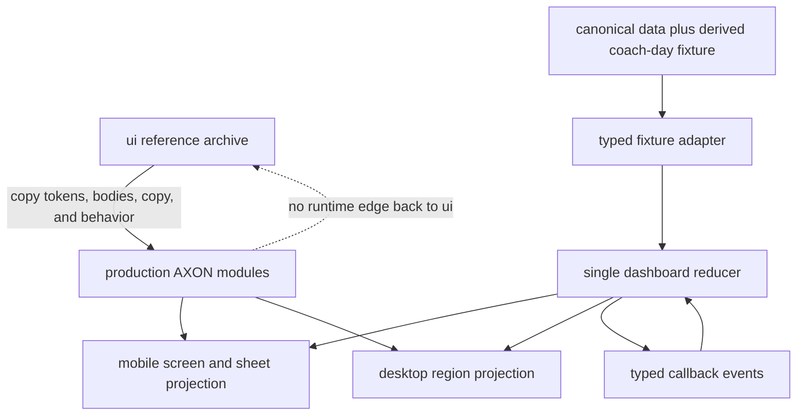

# Copy-First AXON UI Integration - Plan

## Goal Capsule

- **Objective:** Turn the existing AXON prototype into a production-rendered Next.js dashboard by copying its tokens, reusable components, layout, fixture content, and interaction behavior before hardening the copied code behind typed seams.
- **Authority:** `ui/SKILL.md`, `ui/readme.md`, and `ui/Coach Dashboard v2.dc.html` govern the interface. The parent dashboard plan governs later product behavior and safety.
- **Execution profile:** Reach visual and interaction parity at 430 CSS pixels first, then extract typed view models and add a desktop projection over the same local state.
- **Stop conditions:** Stop if production code imports the Design Canvas runtime, copies template-only syntax, creates a second source of fixture data, or represents local demo mutations as server-authoritative behavior.
- **Tail ownership:** This plan ends with a fixture-backed UI and integration-ready callbacks. Neo4j, model-backed Copilot, authentication, publication delivery, and operational hardening remain in the parent plan.

---

## Product Contract

### Summary

The repository needs the fastest reliable path from the AXON prototype to a production application.
The implementation will copy useful source material into an app-owned Next.js structure, render the complete coach-dashboard demonstration with deterministic fixtures, and then harden the copied code without redesigning it.
Completing this focused plan does not complete the broader graph-backed dashboard roadmap.

### Problem Frame

The repository contains a detailed prototype but no production application scaffold.
The prototype mixes reusable React-shaped components with inline styles, separate declaration files, hardcoded state, generated template syntax, and a browser runtime that cannot be shipped as an application dependency.
A rewrite would delay visible progress, while copying the directory unchanged would preserve runtime and state assumptions that block later integration.

### Key Decisions

- **Keep the parent plan and create a focused executable subplan.** (session-settled: user-directed — chosen over rewriting or discarding the broader roadmap: the focused UI can ship first without losing the product and safety contract.) Governs R1-R10.
- **Copy first, then harden in place.** (session-settled: user-directed — chosen over recreating the interface from scratch: the existing AXON work is the fastest path to a faithful production UI.) Governs R2-R9.

### Actor

- A1. **Coach:** Navigates the fixture-backed dashboard, reviews the draft, exercises local demonstration controls, and inspects the resulting UI states.

### Requirements

**Production shell and copied design system**

- R1. A minimal Next.js and TypeScript application renders from the repository root with pinned scripts for development, quality checks, tests, and production build.
- R2. Production-owned AXON tokens and components begin as recognizable copies of the useful files under `ui/`, then compile as application TypeScript and CSS without prototype runtime dependencies.
- R3. The copied design preserves AXON's ink-is-human and Signal-is-machine semantics, typography, spacing, hit targets, motion rules, and calm source-backed voice.

**Fixture-backed dashboard**

- R4. The root route renders Today, Workout, Copilot, History, Profile, Insight, and Decision Path surfaces from one deterministic coach-day fixture.
- R5. Local interactions cover navigation, rationale expansion, guided adjustment, eligible override, approval confirmation, scripted Copilot prompts, pinning, and version history.
- R6. Publication is terminal and read-only in this milestone; it records a lifecycle event against the exact current content version and disables further local mutations.

**Integration readiness and quality**

- R7. One typed dashboard state and event model drives both mobile and desktop projections without resetting state at a responsive breakpoint.
- R8. Screen components receive typed view models and callback props so later parent-plan services can replace the fixture adapter without redesigning the UI.
- R9. The dashboard is keyboard-operable, uses semantic controls and status announcements, honors reduced motion, and remains usable from 320 CSS pixels through desktop widths.
- R10. Production builds contain no import, fetch, execution, or duplicated data dependency from `ui/support.js`, `.dc.html` files, Design Canvas template syntax, runtime Google Fonts, or `ui/uploads/`.

### Key Flows

- F1. Dashboard entry and navigation
  - **Trigger:** A1 opens the root route.
  - **Steps:** Today renders from the canonical fixture; A1 moves among Today, Workout, Copilot, and History and can open Profile or Insight detail.
  - **Outcome:** Navigation changes the visible projection without replacing the dashboard state.
  - **Covers:** R4, R7, R9.
- F2. Local workout review
  - **Trigger:** A1 opens the draft from Today.
  - **Steps:** A1 expands reasons, opens a decision path, adjusts the draft, or records an eligible override reason.
  - **Outcome:** Each completed local change creates one new content version with a visible diff; cancellation creates none.
  - **Covers:** R5-R8.
- F3. Local approval and history
  - **Trigger:** A1 chooses Approve and confirms the current content version.
  - **Steps:** The reducer records one publication event that references the current version, exposes it in History, and disables mutation controls.
  - **Outcome:** The UI consistently identifies the exact locally published version without claiming external delivery.
  - **Covers:** R5-R7.
- F4. Scripted Copilot demonstration
  - **Trigger:** A1 chooses a supported quick prompt or Today insight.
  - **Steps:** The fixture adapter shows a deterministic pending state, returns a sourced answer, and supports pin and detail interactions.
  - **Outcome:** The interaction demonstrates the AXON surface while clearly marking arbitrary free-text Copilot as deferred.
  - **Covers:** R3-R5, R8-R9.

### Acceptance Examples

- AE1. Copy-first production render
  - **Covers R1-R4, R10.**
  - **Given:** A clean checkout and the copied production source.
  - **When:** The application builds and opens the root route.
  - **Then:** The canonical 430-pixel dashboard renders from app-owned files with no prototype runtime or duplicated upload dependency.
- AE2. Adjustment and publication identity
  - **Covers R5-R8.**
  - **Given:** Fixture version 1 is open and unpublished.
  - **When:** A1 completes one adjustment and confirms publication.
  - **Then:** One new content version exists, one publication event references it, and all mutation controls become unavailable.
- AE3. Responsive state continuity
  - **Covers R7, R9.**
  - **Given:** A1 has selected Copilot, pinned an answer, and opened its detail.
  - **When:** The viewport crosses the mobile-to-desktop breakpoint.
  - **Then:** The same selection, pin, detail, and version state remains visible in the desktop composition.
- AE4. AXON semantics without color
  - **Covers R3, R9.**
  - **Given:** Forced colors, reduced motion, or a non-color visual inspection.
  - **When:** A1 compares a coach action with machine-produced provenance.
  - **Then:** Text, glyph, shape, and accessible names preserve the human-versus-machine distinction.

### Success Criteria

- The copied application reaches recognizable AXON parity at 430 by 932 CSS pixels before structural refactoring begins.
- Every reachable demonstration control has a deterministic state transition, cancellation rule, and terminal state.
- The same fixture can be replaced through the typed adapter boundary without changing screen component structure.
- The production build proves that `ui/` remains a reference archive rather than a runtime dependency.

### Scope Boundaries

#### Included

- Minimal Next.js and TypeScript application scaffolding.
- App-owned copies of AXON tokens, fonts, primitives, data components, and agentic components needed by the dashboard.
- One fixture-backed dashboard with mobile parity and a useful desktop composition.
- Local demonstration state, typed view models, callback seams, accessibility checks, and visual regression baselines.

#### Deferred to the Parent Plan

- Neo4j repositories, graph queries, model providers, agent orchestration, server authentication, durable versions, real approval and publication, hosted deployment, and telemetry.
- Arbitrary free-text Copilot input and real streaming responses.
- Multi-member state and production authorization boundaries.

#### Outside this Focused Plan

- Deleting or rewriting the `ui/` reference archive.
- Redesigning AXON or adopting a different component library.
- Claiming clinical, production, or external-delivery behavior from fixture-only interactions.

### Product Contract Preservation

The parent Product Contract is unchanged.
This subplan implements a bounded first slice of parent requirements R32 and R36 and acceptance example AE10; the parent plan remains canonical for all broader behavior.

---

## Planning Contract

### Key Technical Decisions

- KTD1. **Copy into an app-owned boundary.** (session-settled: user-directed — chosen over importing `ui/` directly: production ownership keeps the prototype archive build-disconnected while preserving its work.) Copy selected sources into `src/ui/axon/` and `src/features/coach-dashboard/`; never make `ui/` part of the module graph. Governs R2-R3, R10.
- KTD2. **Use a three-source copy hierarchy.** Reusable component bodies come from `ui/components/`, the clean Today composition comes from `ui/ui_kits/coach-app/index.html`, and complete screen copy and interaction sequencing come from `ui/Coach Dashboard v2.dc.html`. Template-only syntax is behavior reference, not copyable source. Governs R2-R5.
- KTD3. **Preserve copy-first sequencing.** Reach a faithful 430-pixel fixture render while inline styles and local component state are still recognizable, then consolidate types, shared styles, and event handling. Avoid a pre-parity component rewrite. Governs R2, R4-R5.
- KTD4. **Normalize tokens at the production boundary.** Resolve duplicate `--ax-text-*` color and typography names, retain semantic aliases, and bundle Archivo and JetBrains Mono through the application instead of the prototype's runtime Google Fonts import. Governs R1-R3, R10.
- KTD5. **Use one explicit local reducer.** Model navigation, dialogs, pending work, content versions, lifecycle events, pins, and publication in one discriminated state machine with cancellable scheduled effects. Publication is terminal in this subplan. Governs R5-R7.
- KTD6. **Separate fixture data from view models.** Read canonical source records only from `data/`; place derived coach-day demonstration records in one fixture adapter; pass typed view models and events to screens. Governs R4, R7-R8, R10.
- KTD7. **Project one state into two layouts.** Mobile screens and sheets establish parity first. Desktop regions consume the same reducer, view models, and callbacks rather than creating a second dashboard implementation. Governs R7-R9.

### High-Level Technical Design



### State Rules

- Content-changing adjustment and override events create the next numbered `WorkoutVersion`.
- Approval in this milestone creates one `PublicationEvent` that references the current version; it does not create another content version.
- Closing a sheet before confirmation changes no version.
- Adjustment work cannot be dismissed while its deterministic demonstration transition is running.
- Copilot work may complete off-tab, but duplicate submission of the same pending prompt is blocked.
- Crossing the responsive breakpoint changes layout only.

### Output Structure

```text
src/
  app/
    fonts.ts
    globals.css
    layout.tsx
    page.tsx
  features/
    coach-dashboard/
      CoachDashboard.tsx
      CoachDashboard.module.css
      dashboard.fixture.ts
      dashboard.reducer.ts
      dashboard.types.ts
      screens/
  ui/
    axon/
      components/
        agentic/
        core/
        data/
      styles/
        tokens/
tests/
  e2e/
  unit/
  visual/
```

### Sequencing

1. Establish a buildable shell and mechanically copied AXON boundary.
2. Reach mobile fixture parity with all selected local flows.
3. Harden the state, data, accessibility, and responsive seams without changing the approved appearance.

### Risks and Mitigations

- **Copy turns into an early rewrite:** Require the 430-pixel parity checkpoint before extracting abstractions or replacing inline styles broadly.
- **Prototype syntax leaks into production:** Add static checks for generated runtime names, template elements, remote font imports, and `ui/` imports.
- **Token collisions change appearance:** Rename color and typography aliases during the initial copy and cover representative primitives with visual snapshots.
- **Local timers mutate hidden state:** Centralize scheduled effects and test cancellation, navigation, and duplicate submission.
- **Desktop drifts from mobile behavior:** Keep the reducer above the responsive projection and test state continuity while resizing.
- **Fixture UI is mistaken for real workflow authority:** Label scripted behavior in the UI and documentation; do not emit external-delivery or clinical claims.

### Sources and Research

- `ui/SKILL.md` and `ui/readme.md` define AXON semantics, content rules, typography, spacing, motion, and minimum hit targets.
- `ui/components/` provides the reusable JSX bodies and declaration hints to copy into production TypeScript.
- `ui/ui_kits/coach-app/index.html` provides the cleanest token-based Today composition.
- `ui/Coach Dashboard v2.dc.html` is the canonical behavior, fixture-copy, and screen-sequencing reference.
- `docs/plans/2026-08-05-001-feat-graph-backed-coach-dashboard-plan.md` remains the broader product and architecture roadmap.

---

## Implementation Units

### U1. Buildable shell and mechanical AXON copy

- **Goal:** Produce the first buildable production page from copied AXON source without redesigning the components.
- **Requirements:** R1-R3, R10; AE1; KTD1-KTD4.
- **Dependencies:** None.
- **Files:**
  - `package.json`
  - `pnpm-lock.yaml`
  - `.nvmrc`
  - `tsconfig.json`
  - `next-env.d.ts`
  - `next.config.ts`
  - `eslint.config.mjs`
  - `src/app/fonts.ts`
  - `src/app/globals.css`
  - `src/app/layout.tsx`
  - `src/app/page.tsx`
  - `src/ui/axon/styles/tokens/*.css`
  - `src/ui/axon/components/core/*.tsx`
  - `src/ui/axon/components/data/*.tsx`
  - `src/ui/axon/components/agentic/*.tsx`
  - `tests/visual/axon-primitives.spec.ts`
- **Approach:**
  1. Bootstrap the minimal runtime and quality scripts using the same Node, Next, React, and package-manager direction recorded in the parent plan.
  2. Copy the AXON token files and resolve the color-versus-typography alias collisions before global import.
  3. Bundle Archivo and JetBrains Mono through the application font layer and preserve the AXON CSS variable names consumed by components.
  4. Copy the useful component bodies into `.tsx` files with the smallest types required to compile; retain recognizable styles until visual parity exists.
  5. Render a primitive gallery on the root route as the first production smoke proof.
- **Execution note:** This is copy and packaging work; prefer build and browser smoke evidence before abstraction cleanup.
- **Patterns to follow:** `ui/components/`, `ui/tokens/`, `ui/styles.css`, KTD1-KTD4.
- **Test scenarios:**
  1. Covers AE1. A clean install builds the root route and renders representative core, data, and agentic components.
  2. Buttons, tabs, chips, inputs, and dialogs meet the 44-pixel minimum target and expose their native roles and accessible names.
  3. Reduced motion removes arrival and Signal-shimmer animation without hiding state.
  4. A static dependency scan finds no `ui/` import, `support.js`, `.dc.html`, `DCLogic`, `sc-if`, `sc-for`, `style-hover`, remote Google Fonts import, or `ui/uploads/` reference in production source.
  5. Chalk and Carbon token samples preserve readable foreground, surface, border, and Signal semantics after token normalization.
- **Verification:** The app builds, the primitive gallery renders from `src/`, and visual evidence shows copied AXON identity rather than a redesign.

### U2. Complete fixture-backed mobile dashboard

- **Goal:** Reproduce the flagship coach-dashboard demonstration at 430 pixels with complete deterministic local flows.
- **Requirements:** R4-R8, R10; F1-F4; AE1-AE2; KTD2-KTD6.
- **Dependencies:** U1.
- **Files:**
  - `src/app/page.tsx`
  - `src/features/coach-dashboard/CoachDashboard.tsx`
  - `src/features/coach-dashboard/CoachDashboard.module.css`
  - `src/features/coach-dashboard/dashboard.fixture.ts`
  - `src/features/coach-dashboard/dashboard.reducer.ts`
  - `src/features/coach-dashboard/dashboard.types.ts`
  - `src/features/coach-dashboard/screens/*.tsx`
  - `tests/unit/coach-dashboard-state.test.ts`
  - `tests/unit/dashboard-fixture-adapter.test.ts`
  - `tests/e2e/coach-dashboard-mobile.spec.ts`
  - `tests/visual/coach-dashboard-mobile.spec.ts`
- **Approach:**
  1. Copy the Today composition from the coach UI kit and the remaining screen copy and interaction order from the canonical v2 storyboard.
  2. Build one derived coach-day fixture from canonical `data/` source records plus explicit draft, evidence, Copilot, decision-path, and timeline records.
  3. Implement Today, Workout, Copilot, and History tabs plus reachable Profile, Insight, adjustment, override, approval, and Decision Path surfaces.
  4. Keep Copilot fixture-only: supported quick prompts, pending state, pinning, and detail work; arbitrary free-text input is visibly unavailable.
  5. Drive every interaction through the reducer and separate numbered content versions from approval and publication lifecycle events.
  6. Make publication terminal and disable every local mutation control after confirmation.
- **Patterns to follow:** `ui/ui_kits/coach-app/index.html`, `ui/Coach Dashboard v2.dc.html`, `ui/components/data/VersionTimeline.jsx`, KTD2-KTD6.
- **Test scenarios:**
  1. Covers AE1. At 430 by 932 CSS pixels, Today matches the canonical AXON hierarchy, copy, tokens, and sticky navigation.
  2. Today opens Workout; rationale expands; Decision Path opens and returns to the same exercise and version.
  3. Canceling adjustment or override creates no version; confirming either creates exactly one next content version and visible diff.
  4. Adjustment cannot be dismissed during its deterministic pending transition, and it cannot complete twice after repeated input.
  5. An empty or too-short override reason keeps confirmation disabled and preserves the current version.
  6. Covers AE2. Approval publishes the exact current content version, appends one lifecycle event, and disables adjustment, override, and repeat approval.
  7. History distinguishes content versions from lifecycle events and links publication to the correct version.
  8. Supported Copilot prompts show one pending state and one sourced answer; duplicate pending submission is ignored.
  9. Profile and Insight detail return to their originating surface without resetting tabs, pins, or versions.
  10. Fixture-only and externally deferred behaviors are labeled without claiming real delivery, graph execution, or clinical authority.
- **Verification:** A deterministic mobile run completes every focused flow with no hidden timer mutation, duplicate content version, or dead control.

### U3. Typed seams, accessibility, and desktop projection

- **Goal:** Harden the copied dashboard for later service integration while preserving mobile parity and local behavior.
- **Requirements:** R3, R7-R10; F1-F4; AE3-AE4; KTD3-KTD7.
- **Dependencies:** U2.
- **Files:**
  - `src/features/coach-dashboard/CoachDashboard.tsx`
  - `src/features/coach-dashboard/CoachDashboard.module.css`
  - `src/features/coach-dashboard/dashboard.fixture.ts`
  - `src/features/coach-dashboard/dashboard.reducer.ts`
  - `src/features/coach-dashboard/dashboard.types.ts`
  - `src/features/coach-dashboard/screens/*.tsx`
  - `src/ui/axon/components/**/*.tsx`
  - `README.md`
  - `tests/unit/coach-dashboard-state.test.ts`
  - `tests/unit/dashboard-fixture-adapter.test.ts`
  - `tests/e2e/coach-dashboard-responsive.spec.ts`
  - `tests/e2e/coach-dashboard-accessibility.spec.ts`
  - `tests/visual/coach-dashboard-desktop.spec.ts`
- **Approach:**
  1. Extract screen view models and event callbacks from the proven reducer without changing fixture outcomes or approved mobile snapshots.
  2. Consolidate repeated inline structural styles into component and dashboard CSS Modules while retaining dynamic state styles where they improve clarity.
  3. Extend primitive props from native element attributes and add tab state, pressed state, labels, live regions, chart summaries, focus return, and reduced-motion behavior.
  4. Compose a desktop coach workspace as another projection of the same mounted reducer and view models.
  5. Document the reference-to-production mapping, fixture boundary, parent-plan handoff, and the behaviors that remain intentionally scripted.
- **Execution note:** Treat accepted mobile snapshots as characterization coverage while hardening types, styles, and layout.
- **Patterns to follow:** U2 accepted behavior, `ui/readme.md`, AXON token and component sources, KTD3-KTD7.
- **Test scenarios:**
  1. Covers AE3. Resizing from mobile to desktop and back preserves the active tab, current version, publication state, pin state, and open detail.
  2. Replacing the fixture adapter with another object satisfying the same type contract changes content without changing screen composition or reducer code.
  3. Covers AE4. Keyboard-only navigation operates tabs, accordions, dialogs, input controls, and confirmation flows with visible focus and correct focus return.
  4. Status changes for pending adjustment, Copilot completion, validation failure, and publication are announced without relying on animation or color.
  5. At 320 CSS pixels, content reflows without page-level horizontal scrolling or obscured controls; at desktop width, the layout uses available space without duplicating navigation or state.
  6. Forced colors and monochrome inspection preserve coach-action, warning, excluded, and machine-produced provenance meaning.
  7. The accepted 430-pixel snapshots remain unchanged except for reviewed accessibility or token-collision corrections.
  8. The production build and dependency graph remain free of prototype runtime and duplicate fixture references.
- **Verification:** Mobile and desktop pass visual, accessibility, state-continuity, type, and production-build gates; the README makes the later parent-plan integration seam explicit.

---

## Verification Contract

| Gate | Command | Applies to | Done signal |
|---|---|---|---|
| Static quality | `pnpm lint` and `pnpm typecheck` | U1-U3 | Copied and hardened production source passes without ignored errors. |
| State behavior | `pnpm test` | U2-U3 | Reducer, version identity, terminal publication, cancellation, and adapter tests pass deterministically. |
| Browser flows | `pnpm test:e2e` | U2-U3 | All focused coach-dashboard journeys pass at mobile and desktop widths. |
| Accessibility | `pnpm test:a11y` | U1-U3 | Automated checks and documented keyboard, focus, reduced-motion, forced-color, and status-announcement checks pass. |
| Visual regression | `pnpm test:visual` | U1-U3 | Human-approved AXON snapshots pass at 430 by 932, 320 mobile, and the selected desktop width. |
| Production isolation | `pnpm build` | U1-U3 | The build succeeds and contains no prototype runtime, remote font import, or duplicate upload dependency. |

---

## Definition of Done

- The focused plan is independently executable while the parent dashboard plan remains unchanged and canonical for broader behavior.
- A minimal Next.js and TypeScript application builds and renders the copied AXON interface from production-owned files.
- The dashboard covers Today, Workout, Copilot, History, Profile, Insight, adjustment, override, approval, and Decision Path demonstration states.
- One reducer owns the local workflow; mobile and desktop project the same state and retain it across responsive changes.
- Content versions and lifecycle events remain distinct, publication references the exact current version, and publication is terminal in this milestone.
- Canonical data comes only from `data/`; derived demonstration content has one typed fixture owner.
- Screen components expose typed view models and callbacks suitable for later parent-plan service adapters.
- AXON human-versus-machine semantics, typography, spacing, touch targets, motion, copy, and provenance survive the migration.
- Keyboard, focus, status, reduced-motion, forced-color, mobile reflow, desktop composition, and visual checks pass.
- Production code does not import, fetch, execute, or duplicate `ui/` runtime artifacts or uploads.
- Documentation states which behavior is fixture-only and points future service work to the parent plan.
- Abandoned copy experiments, duplicated components, unused prototype-derived state, and temporary styling paths are removed.
